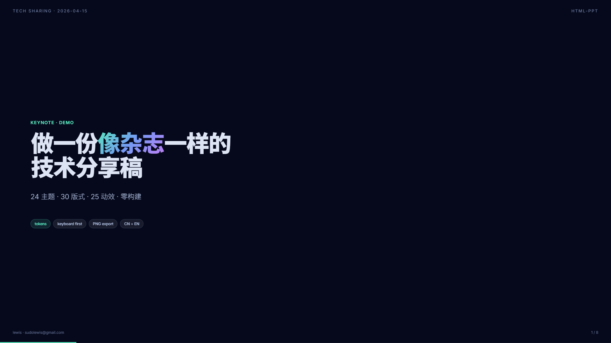
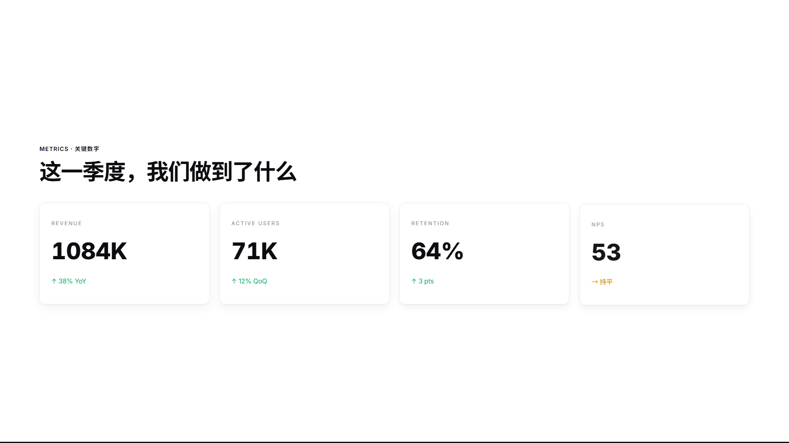

# html-ppt — 让你的 Agent 做出专业级 PPT

> 一行命令安装，agent 立刻拥有 36 主题 × 15 模板 × 31 布局 × 47 动效的完整设计系统。
> 纯静态 HTML/CSS/JS，零构建，零依赖。内置演讲者模式 + 逐字稿提词器。

**Hermes Agent** · **Claude Code** · **Codex** · MIT License



## 你什么时候需要它？

| 你说 | agent 做什么 |
|------|-------------|
| "做一份 8 页技术分享 slides" | 从 `tech-sharing` 模板组装，`tokyo-night` 主题 |
| "做一个小红书图文，9 张" | `xhs-post` 模板，3:4 比例，`xiaohongshu-white` 主题 |
| "我要做产品发布会 PPT" | `product-launch` 模板，`glassmorphism` 主题 |
| "做一份带逐字稿的演讲" | `presenter-mode-reveal` 模板，每页 150-300 字口语化逐字稿 |
| "把这段 outline 变成投资人 pitch deck" | `pitch-deck` 模板，`pitch-deck-vc` 主题 |
| "做一份周报" | `weekly-report` 模板，KPI 网格 + 图表 |

## 安装

```bash
# Hermes Agent
hermes skills install https://github.com/lewislulu/html-ppt-skill

# Claude Code / Codex
npx skills install https://github.com/lewislulu/html-ppt-skill
```

## 它会交付什么？

| 产物 | 说明 |
|------|------|
| `index.html` | 完整多页 HTML 演示文稿，支持键盘导航 |
| PNG 截图 | `render.sh` 导出 1920×1080 PNG |
| 演讲者视图 | 按 `S` 弹出，4 个可拖拽磁吸卡片（当前页/下一页/逐字稿/计时器） |
| 主题切换 | 按 `T` 循环 36 个主题，实时预览 |



## 核心资产

| | 数量 | 说明 |
|---|------|------|
| 🎨 主题 | **36** | 极简白 / 赛博霓虹 / 小红书暖白 / 学术论文 / 投资路演... |
| 📑 完整模板 | **15** | 8 个真实提炼 + 7 个场景脚手架 |
| 🧩 单页布局 | **31** | 封面 / 目录 / KPI / 图表 / 代码 / 流程图 / 时间线 / 甘特图... |
| ✨ CSS 动画 | **27** | 淡入 / 打字机 / 霓虹光晕 / 3D 翻转... |
| 💥 Canvas FX | **20** | 粒子爆发 / 烟花 / 代码雨 / 力导向知识图谱 / 神经网络... |
| 🎤 演讲者模式 | **1** | S 键弹出，BroadcastChannel 双向同步 |

## 触发词

Agent 识别以下关键词时自动加载本 skill：

`presentation` · `ppt` · `slides` · `deck` · `幻灯片` · `演讲稿` · `做一份 PPT` · `做一份 slides` · `小红书图文` · `pitch deck` · `tech sharing` · `speaker notes` · `逐字稿` · `演讲者视图`

## 与同类的区别

| | html-ppt-skill | reveal.js | slidev | Marp |
|---|---|---|---|---|
| Agent-native | ✅ SKILL.md 直接驱动 | ❌ 需 build | ❌ 需 build | ❌ 需 build |
| 零依赖 | ✅ 纯静态 | ❌ npm | ❌ npm | ❌ npm |
| 主题数量 | 36 | ~10 | ~5 | ~3 |
| 模板数量 | 15 | 0 | 0 | 0 |
| 演讲者模式 | ✅ S 键磁吸卡片 | ✅ | ✅ | ❌ |
| 逐字稿 | ✅ 每页 150-300 字 | ❌ | ❌ | ❌ |
| PNG 导出 | ✅ render.sh | ❌ 需额外 | ❌ 需额外 | ✅ |

## 安全边界

- 纯静态文件，不执行任何外部 API 调用
- 不修改系统配置，不安装全局依赖
- 所有资源本地化（CDN 仅用于可选的 Google Fonts）
- `render.sh` 仅调用本地 Chrome，不上传任何数据

## 文件结构

```
html-ppt-skill/
├── SKILL.md              agent 入口（459 行，7 CHECKPOINT，23 失败模式）
├── README.md             本文件
├── README.zh-CN.md       中文说明
├── LICENSE               MIT
├── test-prompts.json     5 个标准化测试 prompt
├── references/           6 个参考文档
├── assets/
│   ├── base.css          设计系统 tokens
│   ├── runtime.js        键盘导航 + 演讲者模式
│   ├── themes/*.css      36 个主题
│   └── animations/       27 CSS + 20 Canvas FX
├── templates/
│   ├── full-decks/       15 个完整 deck 模板
│   └── single-page/      31 个单页布局
├── scripts/
│   ├── new-deck.sh       脚手架
│   └── render.sh         PNG 导出（跨平台）
├── showcase/             展示截图
└── examples/demo-deck/   完整示例 deck
```

## License

MIT © 2026 lewis &lt;sudolewis@gmail.com&gt;
